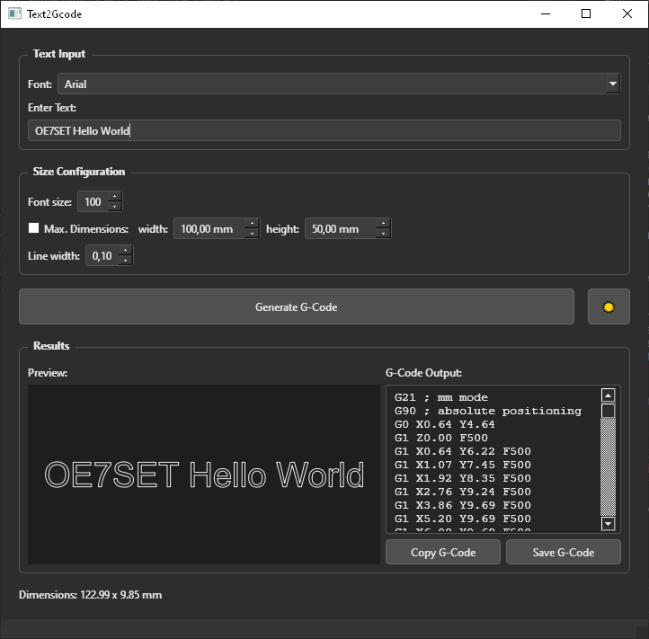

# Text2Gcode

*A lightweight tool to convert text into plotter / CNC friendly G-code with a live Qt preview.*



## Downloads
[](https://github.com/oe7set/Text2Gcode/releases/latest)
[](https://github.com/oe7set/Text2Gcode/releases)

https://github.com/oe7set/Text2Gcode/releases/latest

Prebuilt single-file binaries (PyInstaller):

| Platform | File | Download (latest) |
|----------|------|-------------------|
| Windows x64 | `Text2Gcode-windows-x64.exe` | [Download](https://github.com/oe7set/Text2Gcode/releases/download/v0.1.0/Text2Gcode-windows-x64.exe) |
| Linux x64 | `Text2Gcode-linux-x64` | [Download](https://github.com/oe7set/Text2Gcode/releases/download/v0.1.0/Text2Gcode-linux-x64) |


## Badges


## Overview
Text2Gcode converts a single line of text into basic G-code moves (G0/G1) suitable for pen plotters, light engraving, or CNC simulation. It offers font selection, automatic size fitting, adjustable line width preview, and direct export.

## Features
- System font selection (Qt `QFontComboBox`)
- Adjustable font size or automatic best fit via max width/height (binary search)
- Live vector preview with consistent on-screen line width scaling
- Configurable line width (visual only, not tool diameter compensation)
- Clipboard export
- Save as `.g` / `.gcode`
- Dimension display (mm) based on a fixed scale factor
- Simple, dependency-light codebase

## How It Works
1. Text is converted to a `QPainterPath`
2. Path geometry is scaled (default: `0.1` units → mm)
3. Each path element is emitted as rapid (`G0`) or linear (`G1`) move
4. Pen up/down simulated via Z moves (`safe_z` / `cut_z`)
5. Output ends with `M2`

## Requirements
- Python 3.8+
- PySide6
- (Optional) `uv` for fast, reproducible env management

## Installation (Recommended: uv)
Install `uv`:
```bash
# Linux / macOS
curl -LsSf https://astral.sh/uv/install.sh | sh
# or Windows
powershell -ExecutionPolicy ByPass -c "irm https://astral.sh/uv/install.ps1 | iex"
```
Clone & sync & run:
```bash
git clone https://github.com/oe7set/Text2Gcode.git
cd Text2Gcode
uv venv
uv sync
uv run src/main.py
```

## Usage
1. Enter text
2. Choose font family
3. Option A: Set font size  
   Option B: Enable "Max Dimensions" and define width / height (mm)
4. Adjust preview line width
5. Click "Generate G-Code"
6. Copy or save

## Configuration Notes
| Parameter | Purpose |
|-----------|---------|
| Scale (internal `0.1`) | Converts font units to mm |
| Line width | Only affects preview stroke |
| Safe Z / Cut Z | Hardcoded in `path_to_gcode` (can be extended) |
| Feedrate | Single uniform feed (`F500` default) |


## Safety Notice
Always dry-run or simulate G-code before sending it to real hardware.

## Contributing
Pull Requests welcome:
1. Fork
2. Create feature branch
3. Commit clean changes
4. Open PR

## License
MIT License - see [LICENSE](LICENSE) file for details.

Copyright © 2025.

## Author
[](https://www.buymeacoffee.com/oe7set)

[](https://ko-fi.com/O5O31L3XGA)

**Erwin Spitaler (OE7SET)**  
📧 erwin.spitaler@outlook.com  
📡 vy 73 de OE7SET

---
Enjoy precise text-to-gcode conversion with a minimal, transparent codebase.